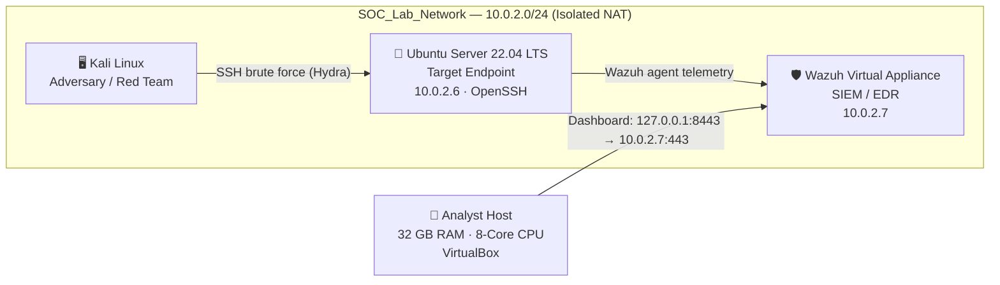

# 🛡️ SOC Home Lab — Wazuh

[](https://www.virtualbox.org/)
[](https://www.kali.org/)
[](https://ubuntu.com/)
[](https://wazuh.com/)
[](https://attack.mitre.org/techniques/T1110/)

A locally hosted Security Operations Center (SOC) environment built to generate endpoint telemetry, execute active adversary attack simulations (Red Teaming), and analyze attack logs and detection rules in real-time (Blue Teaming).

---

## 📑 Table of Contents

- [Project Objective](#-project-objective)
- [Lab Architecture & Specifications](#-lab-architecture--specifications)
- [Phase 1 — Infrastructure Deployment & Telemetry Routing](#phase-1--infrastructure-deployment--telemetry-routing)
- [Phase 2 — Adversary Simulation: SSH Brute Force](#phase-2--adversary-simulation-ssh-brute-force)
- [Phase 3 — Telemetry Analysis & Threat Hunting](#phase-3--telemetry-analysis--threat-hunting)
- [Key Takeaways](#-key-takeaways)
- [Future Enhancements](#-future-enhancements)

---

## 🎯 Project Objective

The goal of this project is to build a fully isolated, locally hosted SOC environment that supports the complete detection lifecycle:

1. **Generate endpoint telemetry** — deploy a monitored target and stream its logs to a SIEM.
2. **Simulate real adversary behavior (Red Teaming)** — execute scripted attack tooling against the target.
3. **Analyze and hunt (Blue Teaming)** — correlate the resulting telemetry, validate detection rules, and extract indicators of compromise (IoCs) in real-time.

> ⚠️ **Security Notice:** All activity in this lab is performed against intentionally vulnerable, isolated virtual machines on a private network. This is an authorized, controlled environment for learning purposes only.

---

## 🧱 Lab Architecture & Specifications

### Host Machine

| Resource | Specification |
|----------|---------------|
| RAM | 32 GB |
| CPU | 8 cores |
| Hypervisor | VirtualBox |

### Network

- **Custom NAT Network:** `SOC_Lab_Network` (`10.0.2.0/24`) — provides full isolation from the home/production network while allowing inter-VM communication.
- **Port Forwarding:** Host `127.0.0.1:8443` → Guest `10.0.2.7:443` — enables secure access to the Wazuh dashboard from the analyst's host machine without exposing the SIEM beyond localhost.

### Topology



### Virtual Machines

| # | VM | Role | IP Address | Key Services |
|---|----|------|------------|--------------|
| 1 | Kali Linux | Adversary (Red Team) | DHCP (10.0.2.x) | Hydra |
| 2 | Ubuntu Server 22.04 LTS | Target Endpoint | `10.0.2.6` | OpenSSH (`sshd`), Wazuh agent |
| 3 | Wazuh Virtual Appliance (OVA) | SIEM / EDR | `10.0.2.7` | Wazuh manager, indexer, dashboard (HTTPS :443) |

<!-- Screenshot placeholder: VirtualBox manager showing the three lab VMs -->

> 📸 *Placeholder — VirtualBox manager showing all three VMs on `SOC_Lab_Network`.*

---

## Phase 1 — Infrastructure Deployment & Telemetry Routing

**Objective:** Stand up the isolated lab network, deploy a monitored target endpoint, and establish a live telemetry pipeline into the SIEM.

### 1.1 Network Isolation & Dashboard Access

- Created the custom NAT network `SOC_Lab_Network` (`10.0.2.0/24`) to fully isolate the lab from the host's physical network.
- Configured port forwarding from the host `127.0.0.1:8443` to the Wazuh appliance `10.0.2.7:443`, so the SIEM dashboard is reachable securely at `https://127.0.0.1:8443` without exposing the appliance.

<details>
<summary>🔧 Equivalent VirtualBox CLI commands (click to expand)</summary>

```bash
# Create the isolated NAT network
VBoxManage natnetwork add \
  --netname SOC_Lab_Network \
  --network 10.0.2.0/24 \
  --enable \
  --dhcp on

# Forward host port 8443 -> Wazuh dashboard (10.0.2.7:443)
VBoxManage natnetwork modify \
  --netname SOC_Lab_Network \
  --port-forward-4 "wazuh-dashboard:tcp:[]:8443:[10.0.2.7]:443"
```
</details>

### 1.2 Target Endpoint Deployment

- Deployed a **headless Ubuntu Server 22.04 LTS** instance (no desktop environment) at `10.0.2.6`.
- Enabled the **OpenSSH daemon** as the primary attack surface, giving the adversary VM a realistic remote-authentication service to target.

```bash
# Verify the SSH daemon is running on the target
sudo systemctl status ssh
```

### 1.3 Wazuh Agent Deployment & Telemetry Verification

- Installed the **Wazuh agent** on the Ubuntu target, pointing it at the Wazuh manager (`10.0.2.7`).
- Started and enabled the `wazuh-agent` service.
- Verified the agent registered and reported as **"Active"** in the Wazuh manager console, confirming the telemetry pipeline was live and streaming endpoint events.

```bash
# Deploy the Wazuh agent on the Ubuntu target
curl -s https://packages.wazuh.com/key/GPG-KEY-WAZUH | \
  gpg --dearmor -o /usr/share/keyrings/wazuh.gpg
echo "deb [signed-by=/usr/share/keyrings/wazuh.gpg] https://packages.wazuh.com/4.x/apt/ stable main" | \
  sudo tee -a /etc/apt/sources.list.d/wazuh.list
sudo apt update

WAZUH_MANAGER="10.0.2.7" sudo apt install -y wazuh-agent

# Start and enable the agent service
sudo systemctl daemon-reload
sudo systemctl enable --now wazuh-agent
```

<!-- Screenshot placeholder: Wazuh manager console showing agent status -->

> 📸 *Placeholder — Wazuh manager console showing the Ubuntu agent (`target-ubuntu`) registered with status **Active**.*

---

## Phase 2 — Adversary Simulation: SSH Brute Force

**Objective:** Execute a controlled, escalating password attack from the Kali adversary VM against the Ubuntu target to generate authentication telemetry that spans both atomic events and correlated detections.

### 2.1 Baseline Test — Single Failure (Control)

A single failed password attempt was executed to establish a baseline and validate the detection pipeline:

```bash
hydra -l root -p invalid_password ssh://10.0.2.6 -t 4 -V
```

| Flag | Purpose |
|------|---------|
| `-l root` | Target username |
| `-p invalid_password` | Single password guess |
| `-t 4` | Number of parallel threads/tasks |
| `-V` | Verbose — show each attempt |

**Result:** The attempt generated an atomic authentication-failure log on the target, which the Wazuh agent forwarded to the manager — but it **successfully remained under the SIEM's correlation threshold**, producing only a low-severity individual event rather than a brute-force alert. This confirmed the detection logic requires sustained failure volume, not a single anomaly.

<!-- Screenshot placeholder: baseline hydra run terminal output -->

> 📸 *Placeholder — Kali terminal showing the single-attempt baseline test and its result.*

### 2.2 Escalated Attack — Automated Dictionary Brute Force

To deliberately trigger the SIEM's correlation rules, the attack was escalated to an automated, multi-threaded dictionary attack using Hydra's built-in `fasttrack` wordlist:

```bash
hydra -l root -P /usr/share/wordlists/fasttrack.txt ssh://10.0.2.6 -t 4 -V
```

| Flag | Purpose |
|------|---------|
| `-l root` | Target username |
| `-P /usr/share/wordlists/fasttrack.txt` | Password wordlist |
| `-t 4` | 4 parallel threads |
| `-V` | Verbose — show each attempt |

**Result:** **262 rapid login attempts** across **4 threads** completed in **under 15 seconds**, flooding the target's authentication logs and driving the event volume well past the correlation threshold.

<!-- Screenshot placeholder: full brute force hydra output -->

> 📸 *Placeholder — Kali terminal showing the 262-attempt dictionary attack in progress.*

---

## Phase 3 — Telemetry Analysis & Threat Hunting

**Objective:** Use the Wazuh dashboard as an analyst would in a live SOC — scope the incident, triage the triggered detections, and pivot into the raw telemetry to extract IoCs.

### 3.1 Scoping the Event Volume Spike

Filtered Wazuh **Endpoint Security** events for the attack window and immediately identified a **massive event-volume spike** — the visual signature of the 262 failed authentication attempts landing in a ~15-second window. This is the first thing an analyst would key on when hunting for anomalous activity.

<!-- Screenshot placeholder: event volume spike graph -->

> 📸 *Placeholder — Wazuh dashboard showing the authentication event volume spike during the attack timeframe.*

### 3.2 Triggered Detection Rules

Analysis of the alerts generated during the attack window identified two key Wazuh rules:

| Rule ID | Level | Description | MITRE ATT&CK | Behavior Detected |
|---------|:-----:|-------------|--------------|-------------------|
| **5710** | 5 | `sshd: authentication failed` | T1110 — Brute Force | Individual failed SSH authentication attempts (atomic events) |
| **5712** | 10 | `sshd: brute force trying to get access to the system` | T1110 — Brute Force | Correlated alert fired when multiple authentication failures exceed the frequency threshold in the defined time window |

**Key observation:** Rule 5710 fired for every individual failed login, while Rule 5712 is the *correlation* rule — it only fired once the volume of 5710 events exceeded the threshold, exactly matching the baseline-vs-escalated behavior observed in Phase 2. This demonstrates the difference between atomic (single-event) and correlated (behavioral) detection logic.

<!-- Screenshot placeholder: rule 5712 alert details -->

> 📸 *Placeholder — Wazuh dashboard showing the Level-10 Rule 5712 brute-force alert with full rule details.*

### 3.3 IOC Extraction from Raw Telemetry

Pivoted into the raw JSON telemetry behind the alerts to extract actionable indicators of compromise:

| Field | Value | Significance |
|-------|-------|--------------|
| `data.srcip` | `10.0.2.x` (Kali VM) | Source IP of the attacking host |
| `data.dstuser` | `root` | Targeted account |
| `data.system_name` | `target-ubuntu` | Affected endpoint |
| `rule.mitre.id` | `T1110` | MITRE ATT&CK technique mapping (Brute Force) |

<details>
<summary>📄 Abridged alert JSON (click to expand)</summary>

```json
{
  "agent": { "name": "target-ubuntu" },
  "data": {
    "srcip": "10.0.2.x",
    "dstuser": "root",
    "srcport": "40212",
    "authentication": { "method": "password" }
  },
  "rule": {
    "id": "5712",
    "level": 10,
    "description": "sshd: brute force trying to get access to the system.",
    "mitre": { "id": ["T1110"] }
  },
  "system_name": "target-ubuntu"
}
```
</details>

From this telemetry alone, an analyst can reconstruct the incident: **a brute-force attack (T1110) against the `root` account on `target-ubuntu`, originating from the Kali adversary host** — all the context needed to escalate, block, and remediate.

<!-- Screenshot placeholder: raw JSON alert in Wazuh -->

> 📸 *Placeholder — Wazuh dashboard showing the raw JSON alert with the extracted IoC fields highlighted.*

---

## 🔑 Key Takeaways

- **Isolation by design** — a custom NAT network and localhost-only port forwarding let you run live attack tooling safely on a home network.
- **Atomic vs. correlated detection** — a single failed login (Rule 5710, Level 5) is noise; the correlation rule (Rule 5712, Level 10) is the signal. Threshold tuning is what separates them.
- **Telemetry-first workflow** — the raw JSON behind an alert is where the real investigative value lives: `srcip`, `dstuser`, and MITRE technique mappings turn an alert into an incident narrative.
- **Full lifecycle coverage** — the lab replicates the red-team → generate → detect → hunt loop a production SOC operates every day.

---

## 🚀 Future Enhancements

- [ ] Expand attack coverage: password spraying, credential stuffing, and lateral movement simulations (e.g., via Atomic Red Team / CALDERA).
- [ ] Configure Wazuh **Active Responses** (e.g., automatic IP blocking via `firewalld`/`iptables`) to close the loop with automated response.
- [ ] Integrate additional log sources (Sysmon-style Linux auditing, network/firewall logs) for richer correlation.
- [ ] Tune detection thresholds and build custom rules to reduce false positives.
- [ ] Document a full incident-response runbook based on the extracted IoCs.

---

<p align="center">
  <i>Built for hands-on SOC, detection engineering, and threat hunting practice.</i>
</p>
